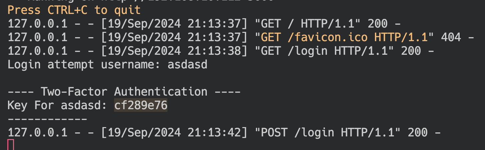

# Short Description

This project is designed to [provide a brief overview of your project's purpose and functionality].

## How to Run the Code

1. Activate my virtual environment in that directory:  
   ```source myenv/bin/activate```

2. Make sure my required libraries are install:  
   ```pip install -r requirements.txt```

3. Ensure everything is set up correctly before running the application.

4. Run the main program:  
   ```python3 main.py```
   
5. For login or password reset, two-factor authentication is enabled.  
The authentication code will be provided in the log info in terminal.


